<!-- HERO BANNER -->
<picture>
  <source media="(prefers-color-scheme: dark)" srcset="./dark.svg">
  <source media="(prefers-color-scheme: light)" srcset="./light.svg">
  
</picture>

 

 

<!-- SOCIAL LINKS -->
&nbsp;&nbsp;
&nbsp;&nbsp;

  

---

## 👨‍💻 About / Focus

Hi, I'm **Manish**, a beginner Full-Stack Developer 💻.  
I love to build simple projects and learn new tools, with an active interest in **Cloud**, **APIs**, and **Automation**.

- 🧠 **Learning:** Web Development, Python, JavaScript, and Java
- 🎧 **Vibe:** Coding with Bhojpuri songs 🎶
- 🚀 **Currently Building:** Hand Detector, Motion Tracking, Personal Portfolio

 

## 🛠 Engineering Stack

---

## 📡 Signals

<table>
<tr>
<td width="50%" align="center" valign="middle">

</td>
<td width="50%" align="center" valign="middle">

</td>
</tr>
</table>

---

## 📊 GitHub Activity

  

 

` Built with love 🤍 @hmpmanish `

